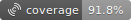
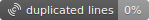
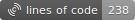
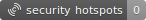

<div style="display: flex; justify-content: center; gap: 10px;">




.


</div>
# Anthony Menghi - 20212098 - M1DWM - Univeristé de Corse

### Les tests sont lancer avec l'IDE (VScode)

.

### Le rapport Cucumber

Le rapport est dans `./cucumber-report.pdf` ou `./cucumber-report.html`

### Le rapport SonarQube

Le rapport est dans `./sonar-qube-report.pdf`

#### Le lancer

```
docker compose up -d
```

#### Lancer l'analyse

```bash
./mvnw clean verify sonar:sonar \ -Dsonar.projectKey=carental \
 -Dsonar.host.url=http://localhost:9000 \
 -Dsonar.login=TOKEN \
 -Dsonar.coverage.jacoco.xmlReportPaths=target/site/jacoco/jacoco.xml
```

### Jmeter

Le rapport est dans `./jmeter-report.pdf`

#### Lancer le test

```bash
jmeter -n -t  jmeter.jmx -l results.jtl -e -o jm-report
```

---

Fait sur macbook air ARM M1
